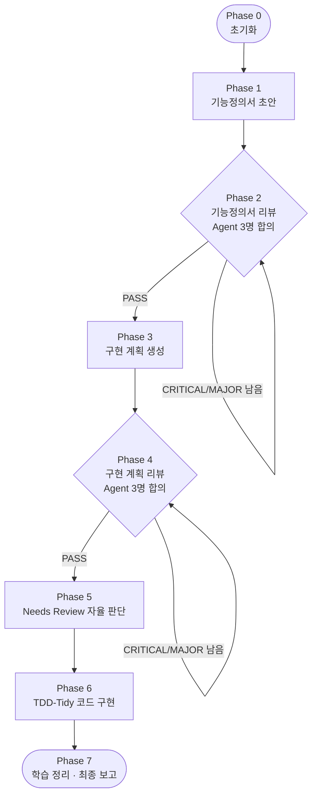

<h1 align="center">consensus-build</h1>

<p align="center">
  한 줄 기능 설명만 주면 <b>기능정의서 → 구현 계획 → 코드 구현</b>까지 자동으로 완주하는 Claude Code 플러그인
</p>

<p align="center">
  <a href="LICENSE"></a>
  <a href="https://github.com/NB3025/consensus-build/stargazers"></a>
  
  
</p>

```text
"이미지 업로드하면 자동 태깅"   ← 한 줄 입력
        │
        ▼
  기능정의서 ──▶ 🔍 리뷰 (Agent 3명 합의)
        │
        ▼
  구현 계획  ──▶ 🔍 리뷰 (Agent 3명 합의)
        │
        ▼
  실제 코드  ──▶ ✅ TDD로 테스트 통과
```

각 단계에서 **Agent 3명이 병렬로 독립 검토**하여 합의(consensus)에 이르고, CRITICAL/MAJOR 이슈가 사라질 때까지 자율 반복합니다. TDD + Tidy First 원칙으로 실제 코드를 작성하고 테스트를 통과시킵니다.

---

## ✨ What is consensus-build?

기능 한 줄만 던지면, 그 자리에서 멈추지 않고 **배포 가능한 코드까지** 스스로 완주하는 파이프라인입니다.

- 🧩 **한 줄 → 완성** — 기능 설명 한 줄이 기능정의서·구현계획·소스·테스트로 펼쳐집니다.
- 🗳️ **합의 기반 리뷰** — 문서마다 Agent 3명이 *서로의 결과를 모른 채* 독립 검토하고, 가중 투표로 이슈를 합의합니다.
- 🔁 **자율 반복** — CRITICAL/MAJOR 이슈가 없어질 때까지(최대 5라운드) 사람 개입 없이 고쳐 나갑니다.
- 🧪 **진짜 코드, 진짜 테스트** — Red → Green → Refactor를 실제로 돌려 테스트를 통과시킵니다.
- 🛡️ **안전한 격리** — 모든 hook은 상태 파일과 `session_id`로 가드되어, 무관한 작업에는 영향이 없습니다.

## ⚡ 설치

```
/plugin marketplace add NB3025/consensus-build
/plugin install consensus-build@consensus-build-marketplace
```

> 이 repo 자체가 플러그인이며, `marketplace.json`이 상대경로(`./`)로 자신을 가리킵니다. 따라서 마켓플레이스를 add할 때 받은 로컬 사본에서 플러그인을 바로 읽어, **별도 git clone 없이 SSH 키가 없어도 설치**됩니다.
>
> 포크했다면 `marketplace add`의 `owner/repo`만 본인 경로로 바꾸면 됩니다.

## 🚀 사용법

```
/consensus-build:build [모델] <기능 설명>
```

> 플러그인으로 설치된 스킬은 충돌 방지를 위해 항상 `플러그인명:스킬명` 형태로 호출됩니다. 그래서 커맨드가 `/consensus-build:build`입니다(`/` 입력 후 메뉴에서 선택해도 됩니다).

`모델`은 `opus`(기본) / `sonnet` / `haiku` 중 선택할 수 있습니다.

### 모드

| 호출 | 동작 |
|------|------|
| `/consensus-build:build [모델] <기능 설명>` | 전체 파이프라인 (Phase 0→7): 기능정의서·구현계획·코드까지 |
| `/consensus-build:build review-spec [모델] <기능정의서 경로>` | 기능정의서 리뷰만 |
| `/consensus-build:build review-impl [모델] <구현계획 경로>` | 구현계획 리뷰만 |
| `/consensus-build:build plan [모델] <기능정의서 경로>` | 기존 정의서 → 계획+구현 |
| `/consensus-build:build implement [모델] <구현계획 경로>` | 구현만 |

### 예시

```
/consensus-build:build 사용자가 이미지를 업로드하면 자동으로 태그를 다는 기능
/consensus-build:build sonnet review-spec docs/feature-spec-image-tagging.md
```

## 🔄 작동 방식

전체 파이프라인은 8개 Phase를 순서대로 완주합니다. 리뷰 단계는 이슈가 없을 때까지 자율 반복합니다.



| 단계 | 하는 일 |
|------|---------|
| **Phase 0** | 상태 파일 생성, 과거 학습(`learnings.md`) 로드 |
| **Phase 1** | 15개 섹션을 갖춘 상세 기능정의서 작성 |
| **Phase 2** | Agent 3명 병렬 리뷰 → 가중 투표로 이슈 합의 → 반영 (최대 5라운드) |
| **Phase 3** | TDD+Tidy 원칙으로 TASK 단위 구현 계획 작성 |
| **Phase 4** | 구현 계획을 같은 방식으로 합의 리뷰 |
| **Phase 5** | 보류된 Needs Review 이슈를 자율 판단해 문서에 반영 |
| **Phase 6** | Red → Green → Refactor로 실제 코드·테스트 작성, TASK별 커밋 |
| **Phase 7** | 학습 기록 정리 후 최종 보고 |

### 합의(consensus)는 어떻게 이뤄지나

- **독립성** — 각 라운드에서 Agent에게는 *동일한 프롬프트*만 전달됩니다. 라운드 번호도, 이전 라운드 결과도 알려주지 않아 매번 "처음 보는 것처럼" 검토합니다.
- **인용 검증** — Agent가 든 원문 인용이 실제 문서에 없으면 확신도를 강제로 낮춰, 근거 없는 환각 이슈를 걸러냅니다.
- **가중 투표** — `확신도 × 근거강도`로 이슈를 🔴 High Confidence / 🟡 Needs Review / ⚪ Low Priority로 분류합니다.

## 🧱 구성 요소

| 종류 | 내용 |
|------|------|
| **Skill** | `/consensus-build:build` 슬래시 커맨드 (`skills/build/`) |
| **Hooks** | Stop hook (파이프라인 완주 전 종료 차단), PostToolUse/PostToolUseFailure hook (Phase 6 테스트 성공·연속실패 추적) |

### Hook 동작 범위

모든 hook은 프로젝트의 `.claude/consensus-build-state.local.md` 상태 파일과 `session_id`로 가드됩니다. 파이프라인이 비활성이거나 다른 세션이면 즉시 통과(no-op)하므로, 플러그인을 설치해도 consensus-build와 무관한 작업에는 영향을 주지 않습니다.

## 📦 산출물

파이프라인은 대상 프로젝트의 `docs/` 아래에 다음을 생성합니다.

| 파일 | 내용 |
|------|------|
| `feature-spec-{name}.md` | 기능정의서 |
| `impl-plan-{name}.md` | 구현 계획 |
| `decisions-log.md` | 자율 결정 로그 |
| `review-round-*.md`, `impl-review-round-*.md` | 리뷰 라운드 기록 |
| `learnings.md` | 학습 기록 (append) |
| `src/`, `tests/` | 구현된 소스·테스트 코드 |

## 🧰 요구사항

- Claude Code
- `jq` 권장 (hook의 JSON 처리에 사용. 없으면 `python3` fallback)

## 🚫 범위 밖 (Non-goals)

- 사람의 단계별 승인을 받으며 진행하는 대화형 워크플로우 — 이 플러그인은 **자율 완주**가 목적입니다.
- 멈춰서 묻기 — 불명확한 요구사항도 보수적으로 자율 판단하고 `decisions-log.md`에 남깁니다.

## 🔧 로컬에서 검증

repo 루트(`marketplace.json`이 있는 곳)에서 실행합니다.

```
claude plugin validate .
claude plugin marketplace add ~/consensus-build
```

## 📄 License

MIT — [LICENSE](LICENSE) 참조.
